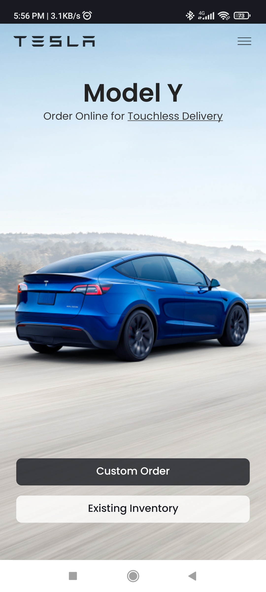
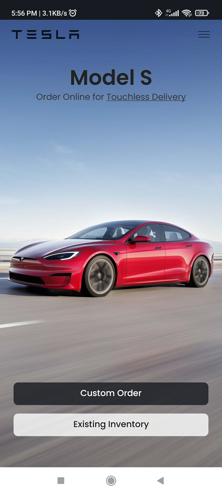
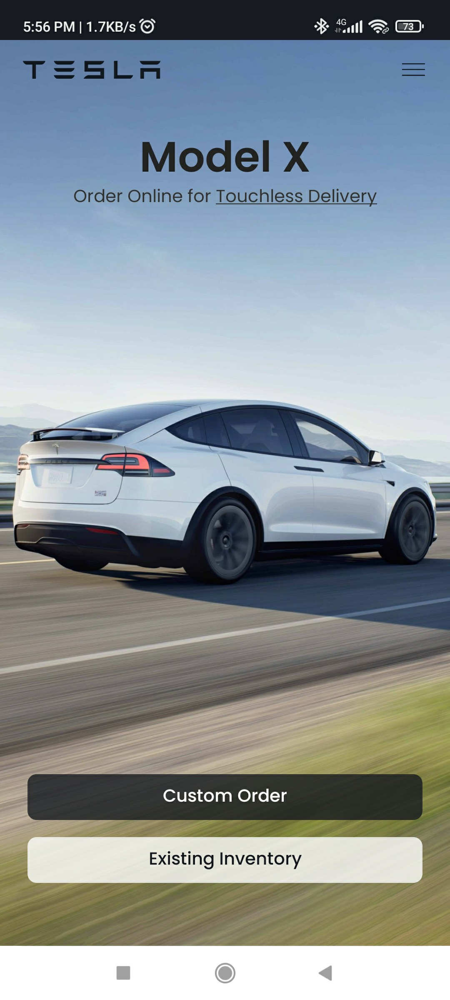

# TeslaClone App

## Description

### In this project, I am developed clone application of the Offical [Tesla](http://tesla.com) Website by using **React Native**.

## Preview

<video width="200" controls autoplay loop>
  <source src="SS/video1.mp4" type="video/mp4">
  Your browser does not support HTML video.
</video>

## ScreenShot

    
    
    
    

## Contributing

Please fork this repository and contribute back. Any contributions, large or small, major or minor features, bug fixes, are welcomed and appreciated but will be thoroughly reviewed.

## Support

